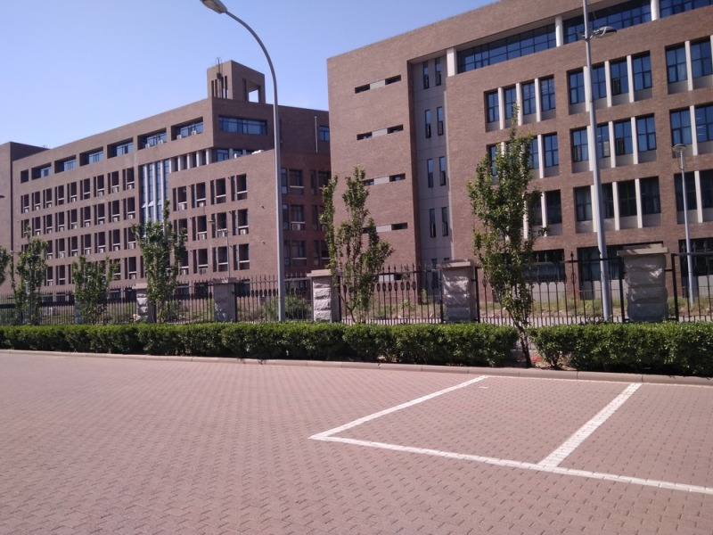
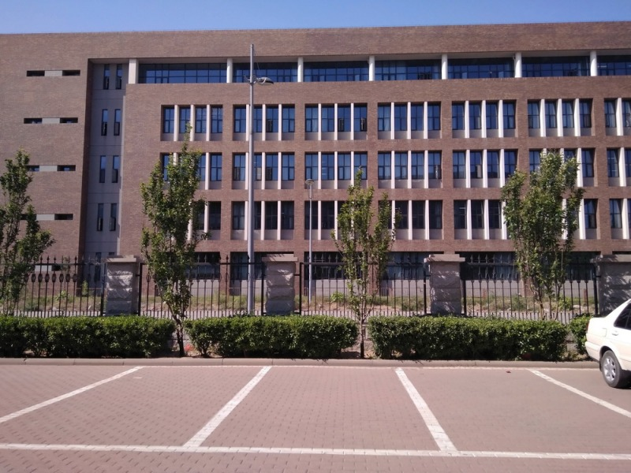
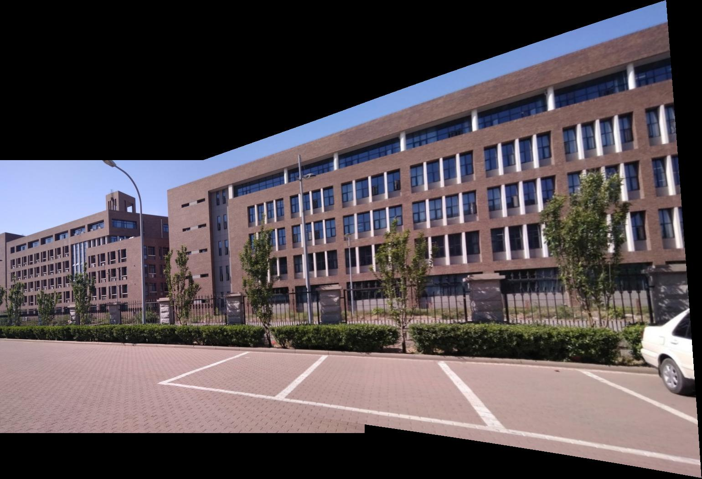
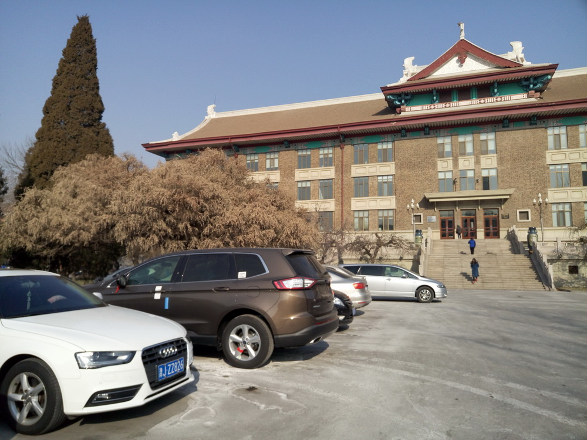
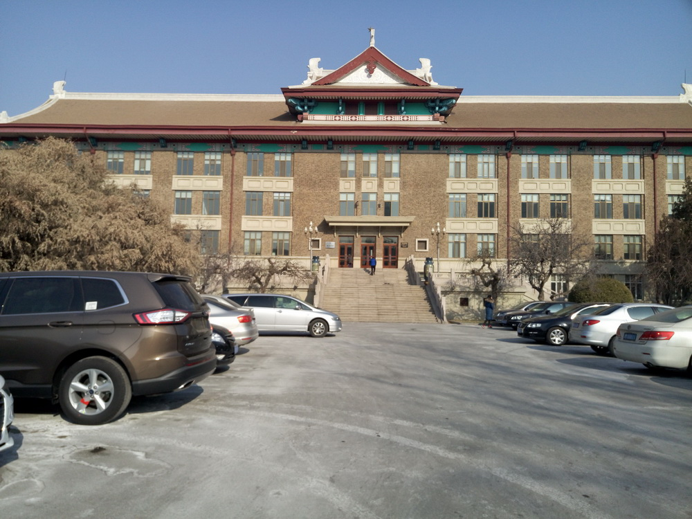
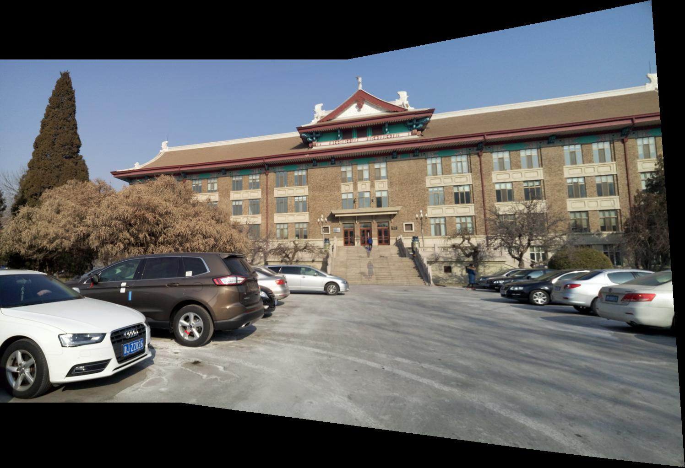

# Single-Perspective Warps in Natural Image Stitching

## Project Overview

This repository implements single perspective warping techniques based on the IEEE TIP 2019 paper "Single-Perspective Warps in Natural Image Stitching". The project is primarily useful for:
- Image stitching
- Natural scene composition

## Project Proposed:
1. Implementation of selected 2-image stitching methods:
    - [1] Tianli Liao and Nan Li. Single-perspective warps in natural image stitching. IEEE Transactions on Image Processing, 29:724–735, 2020.
    - [2] Tianli Liao, Ce Wang, Lei Li, Guangen Liu, and Nan Li. Parallax-tolerant image stitching via segmentation-guided multi-homography warping, 2024
2. Extending the approach for multiple image stitching.
3. Qualitative and Quantitative comparison of the implemented methods and currently
existing methods using metrics like RMSE and other Image Quality Assessment (IQA)
metrics like PSNR, SSIM, and LPIPS.

## Objectives Achieved
1. Implementation of the 2-image stitching method mentioned in the following paper:
    - [1] Tianli Liao and Nan Li. Single-perspective warps in natural image stitching. IEEE Transactions on Image Processing, 29:724–735, 2020.
2. Extending the approach for multiple image stitching.
3. Qualitative and Quantitative comparison of the implemented methods and currently
existing methods using metrics like RMSE and other Image Quality Assessment (IQA)
metrics.

## Repository Structure

The repository is organized into two main components:
- Two-Image Stitching
- Multi-Image Stitching

## Technical Dependencies

### Software Requirements
- MATLAB R2010 or higher
- VLFeat toolbox

### Required Toolboxes
- Image Processing Toolbox
- Computer Vision Toolbox
- Statistics and Machine Learning Toolbox
- Signal Processing Toolbox
- Matlab Toolbox for Quantum Computing

### Custom MEX Files
- LSD_matlab
- texture_mapping
- compute intersection

## Usage Instructions

1. Download the code
2. Add images to the "Images" folder
3. Run "main.m"

### Platform Compatibility
- Tested on 64-bit Windows
- For other platforms, compile custom MEX files in:
  - LSD_matlab folder
  - texture_mapping folder
  - multigs folder

## Code Flow Analysis

### 1. Entry Point
The application flow begins with `main.m` in either the TwoImage or MultiImage directory:
- Image Loading and Preprocessing

### 2. Core Processing Pipeline

#### Initialization and Setup
- Configure VLFeat toolbox
- Add necessary paths
- Set grid size and energy minimization parameters

#### Feature Detection and Matching
- SIFT for point matching
- LSD (Line Segment Detector) for line detection
- Novel Coplanar Line-points Invariants for robust line matching

#### Perspective Analysis and Warping
Key steps include:
- Corner Detection
- Homography Calculation
- Energy Minimization

#### Energy Minimization Parameters
The warping process uses four energy terms:
- Alignment
- Naturalness
- Distortion
- Saliency

#### Energy Term Calculation

- Generate sample points along vertical and horizontal lines
- Compute alignment constraints from feature matches
- Calculate line segment preservation constraints

#### Optimization Process

- Formulate sparse linear system representing the energy minimization problem
- Use LSQR (Least Squares QR) iterative method to solve for optimal mesh deformation
- Compute optimized control vertex positions

#### Image Warping and Blending

- Apply mesh-based deformation to the source image
- Create a canvas accommodating both warped and reference images
- Perform linear blending of transformed images

#### Computational Objectives

- Maintain geometric integrity of original images
- Minimize visual distortions during transformation
- Create seamless image alignment with smooth transitions

## Input Requirements

### Image Specifications
- Format: JPG
- Location: "Images" folder

### Quantity Requirements
- Two-Image version: 2 images
- Multi-Image version: Minimum 3 images

## Output Specifications

- Warped images saved in results directory of that specific input images folder.

## Results

### Two-Image Stitching

#### Input1:

#### Output1:

#### Input2:

#### Output2:

### Multi-Image Stitching

#### Input:

#### Output:

## Metrics

We compared the results of our approach using some standard well known image stitching algorithms: simple homography warp and APAP. All three algorithms were applied on three image stitching datasets found online.

Metrics used:
- RMSE: Root mean squared error of between point correspondance of a point in target image (obtained from point features matching) and the point obtained after applying the warp to the original point.

- % Outliers: Pixel-wise error where a pixel x in I is an outlier if no pixel within a 4-pixel neighbourhood of t(x) in I’​ has an intensity difference of less than 10 grey levels. The warping error is the percentage of outliers in the overlapping region.

The results are plotted below. Our algorithm performed better than the other two in every dataset.

## Citation
[1] Tianli Liao and Nan Li. Single-perspective warps in natural image stitching. IEEE Transactions on Image Processing, 29:724–735, 2020.